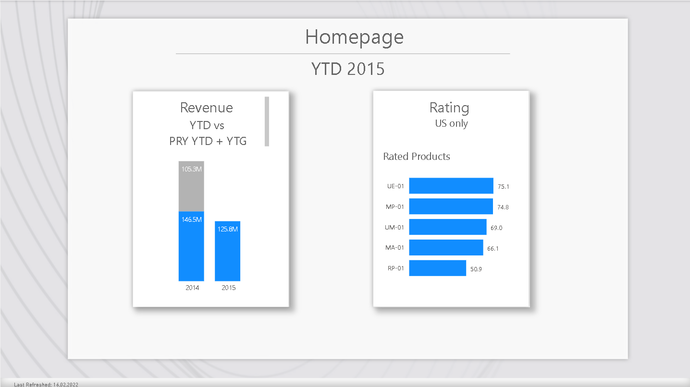
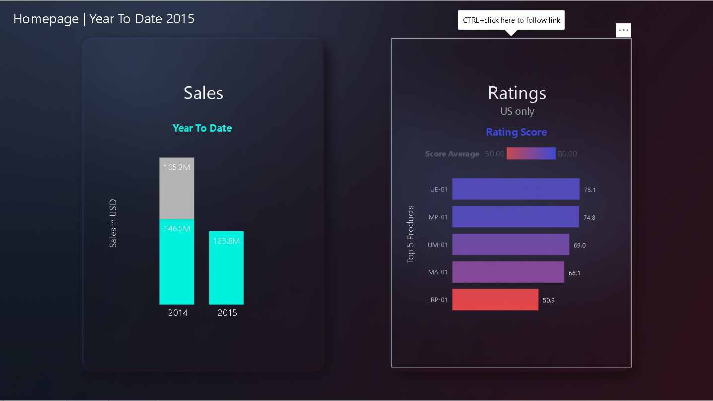
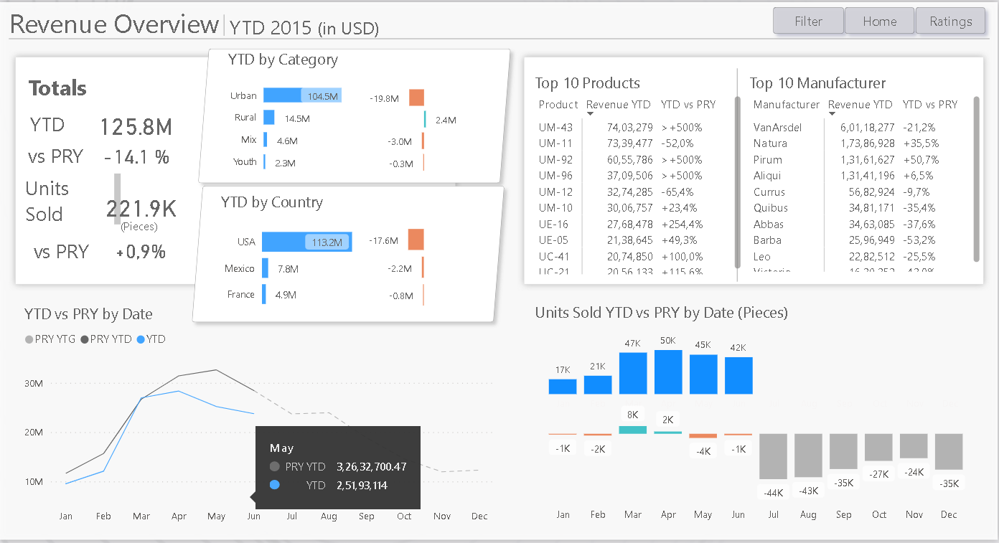
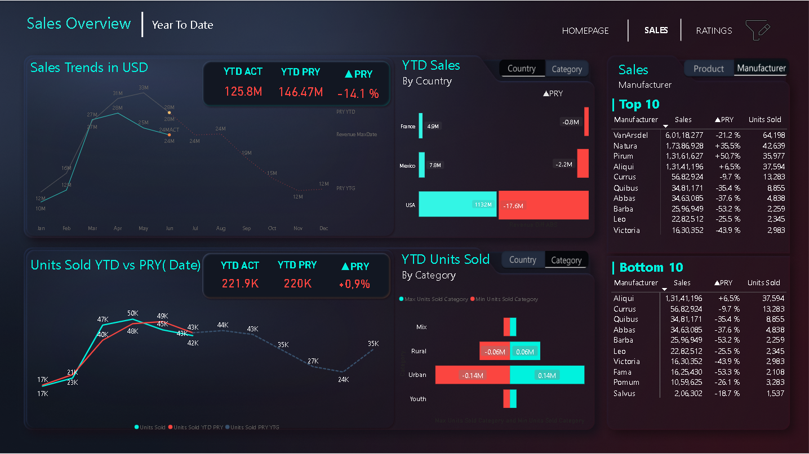
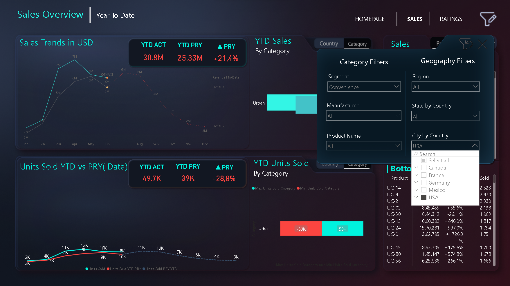
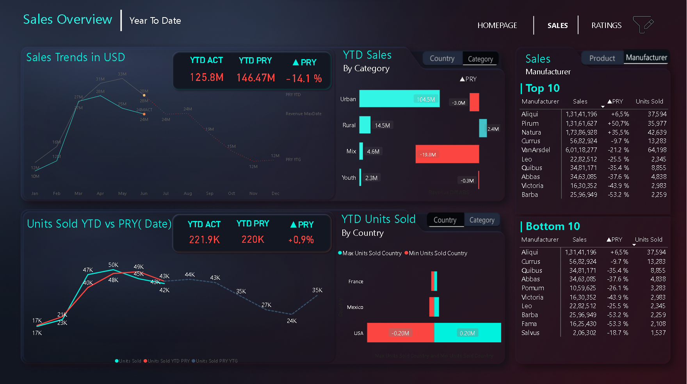
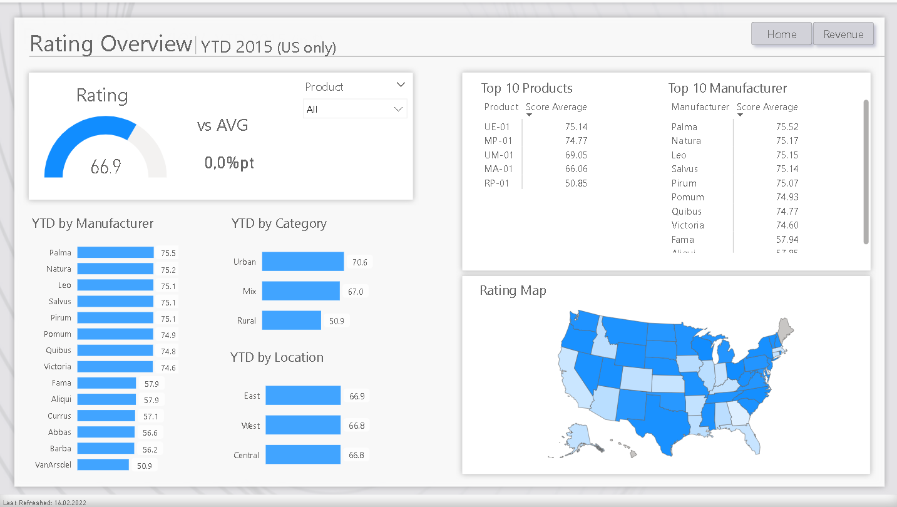
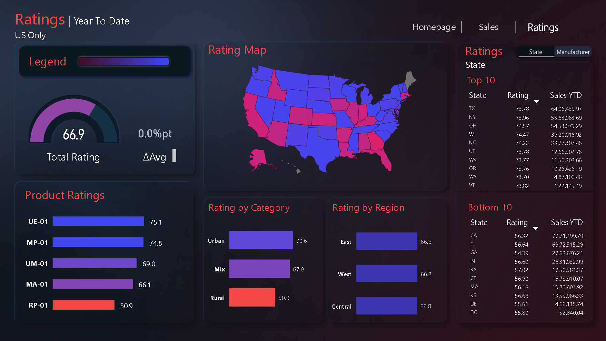
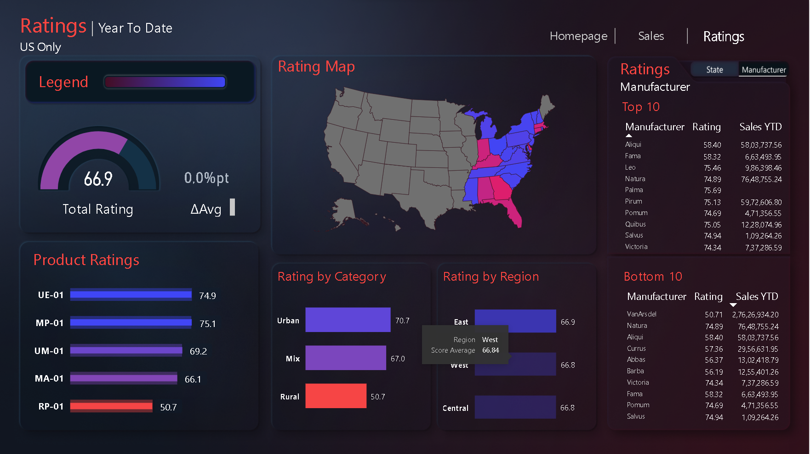
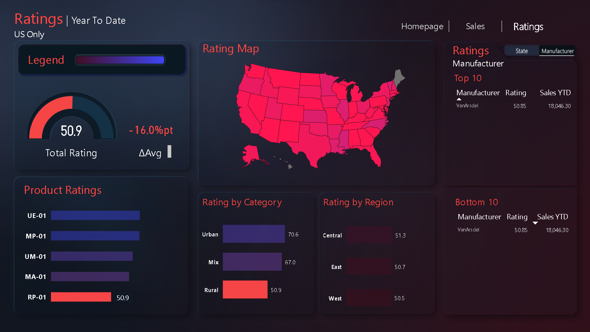

# Power BI US Revenue Dashboard Documentation
## Overview
Welcome to the documentation for the US Revenue Power BI Dashboard! This document provides a concise overview of the key features and insights offered by the dashboard. For a more detailed explanation, please refer to the attached files on my GitHub account. The aim of this project is to exhibit my skills in analyzing and visualizing Sales data with user friendly navigation using Power BI.
## Introduction 
The US Revenue Power BI Dashboard is designed to provide valuable insights into sales trends, ratings, and relationships within a given dataset. It offers a user-friendly interface and employs effective visualization techniques to enhance understanding.
The Report consists of three pages:

1.  **Homepage** 
2.  **Sales**
3.  **Ratings**

## Problem Statement 
Develop a Power BI dashboard to analyze and visualize US revenue trends and ratings. The dashboard should display yearly sales trends, ratings for top/bottom states and manufacturers, and provide interactive insights into sales by category and country. Create an intuitive user interface with filters and dynamic rankings for manufacturers and products. The goal is to enhance data-driven decision-making and provide a comprehensive overview of sales performance and customer satisfaction.

## Skils / Concepts Demonstrated 
- Bookmarking
- DAX
- Quick measures
- Page Navigation
- Modelling
- Tooltips
- Filters
- Buttons
- Slicers
- KPI's

# Pages
## HomePage

- Sales per year summarized using a stacked column chart.
- Ratings for the top 5 products displayed through a clustered bar chart.
- Interactive charts with navigation to corresponding pages on click.

**_Before_**

**_After_**

---
## Sales Page
- Sales trend in the USA for the year 2015 shown via a line chart.
- Year-to-date (YTD) sales and units sold compared to the previous year represented through line charts.
- YTD sales and units sold by category and country visualized using a clustered bar chart.
- Buttons for switching between categories and countries.
- Dedicated filter button to adjust insights.
- Top 10 and bottom 10 manufacturers and products with sales and units displayed in a dynamic table.
- Navigation buttons for easy page transition.
  
**_Before_**

**_After_**

---

## Ratings Page 

- Ratings of top 10 and bottom 10 states and manufacturers showcased.
- Switch button to toggle between state and manufacturer data.
- Total rating displayed using a gauge chart.
- Rating map indicating ratings by region, state, and city with color-coded differentiation.
- Clustered bar chart displaying category and region-wise product ratings.

**_Before_**

**_After_**

---
## Key Features

- **_Interactive Visualizations_**: The dashboard employs interactive charts and buttons for seamless exploration of data trends and comparisons.
- **_Data Filters_**: The dashboard allows users to modify the view using dedicated filter buttons, enhancing the ability to extract meaningful insights.
- **_Top and Bottom Rankings_**: Dynamic tables display top and bottom manufacturers and products based on sales, ▲PRY, and units sold, with toggle buttons for product/manufacturer view.
- **_Ratings Analysis_**: Ratings for states, manufacturers, and products are effectively visualized through a variety of charts, including a gauge chart and a color-coded rating map.

---

**_Your feedback and suggestions are invaluable for improving this dashboard further. Feel free to explore the GitHub repository for the attached files and check out other dashboards as well. Your insights will play a crucial role in refining this visualization tool. Thank you for your engagement!_**

---
**_For more in-depth explanations and to experience the full functionality of the dashboard, please review the attached files on GitHub.
Your input will greatly contribute to enhancing this dashboard's effectiveness and visual appeal._**

---
